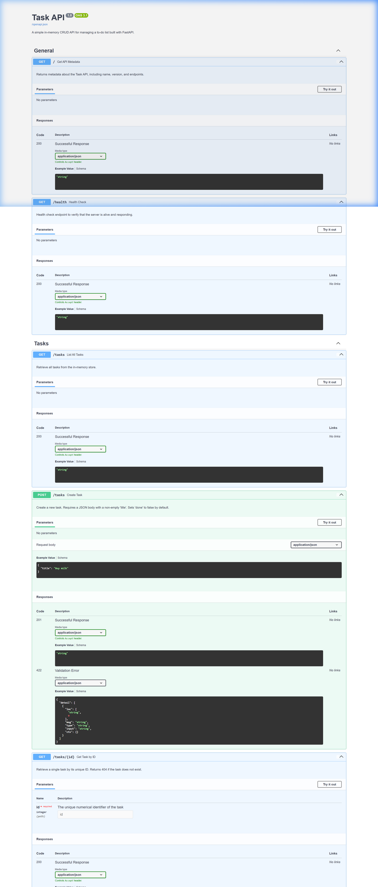

# Readme is created using AI
# Task CRUD API

A clean, production-ready in-memory **CRUD API** for managing a to-do list built with **FastAPI**, featuring automatic OpenAPI / Swagger UI documentation, strict input validation, and standard HTTP status codes.

---

## 🚀 Quickstart & How to Run

### Run with Virtual Environment (Windows)
```powershell
.\fast.venv\Scripts\uvicorn.exe main:app --reload --port 8000
```

### Or using Python module directly
```bash
python -m uvicorn main:app --reload --port 8000
```


Once running, interactive API docs are available at:
- **Swagger UI**: [http://localhost:8000/docs](http://localhost:8000/docs)
- **ReDoc**: [http://localhost:8000/redoc](http://localhost:8000/redoc)
- **OpenAPI JSON**: [http://localhost:8000/openapi.json](http://localhost:8000/openapi.json)

To run the automated test suite:
```bash
python test_api.py
```

---

## 📋 API Endpoints

| HTTP Verb | Endpoint | Status Code | Description | Example Request Body |
| :--- | :--- | :--- | :--- | :--- |
| `GET` | `/` | `200 OK` | API root metadata | _None_ |
| `GET` | `/health` | `200 OK` | Server health check (`{"status": "ok"}`) | _None_ |
| `GET` | `/tasks` | `200 OK` | List all tasks | _None_ |
| `GET` | `/tasks/{id}` | `200 OK` / `404 Not Found` | Retrieve single task by ID | _None_ |
| `POST` | `/tasks` | `201 Created` / `400 Bad Request` | Create a new task | `{"title": "Buy milk"}` |
| `PUT` | `/tasks/{id}` | `200 OK` / `400 Bad Request` / `404 Not Found` | Update task title and/or done status | `{"title": "Buy oat milk", "done": true}` |
| `DELETE` | `/tasks/{id}` | `204 No Content` / `404 Not Found` | Delete a task | _None_ |

---

## 🧪 Sample `curl -i` Output

### 1. Create a Task (`POST /tasks`)
```http
HTTP/1.1 201 Created
date: Wed, 19 Aug 2026 08:00:00 GMT
server: uvicorn
content-length: 44
content-type: application/json

{"id":4,"title":"Buy milk","done":false}
```

### 2. Read Single Task (`GET /tasks/1`)
```http
HTTP/1.1 200 OK
date: Wed, 19 Aug 2026 08:00:01 GMT
server: uvicorn
content-length: 50
content-type: application/json

{"id":1,"title":"Buy groceries","done":false}
```

### 3. Error Case — Task Not Found (`GET /tasks/99`)
```http
HTTP/1.1 404 Not Found
date: Wed, 19 Aug 2026 08:00:02 GMT
server: uvicorn
content-length: 30
content-type: application/json

{"error":"Task 99 not found"}
```

---

## 📸 Swagger UI Screenshot



---

## 💡 The Mortality Experiment

When we add tasks to the in-memory store and subsequently restart or terminate the server process, querying `GET /tasks` reveals that only the original pre-seeded tasks remain. This happens because variables in memory exist exclusively within the process's volatile RAM address space; when the process terminates, all runtime memory is released by the operating system. Persistent databases exist precisely to solve this problem by flushing state to non-volatile disk storage.

---

## 🤖 Stage 7: AI vs Me

### The Prompt
> "Build a minimal in-memory CRUD REST API in Python using FastAPI for managing a to-do list. The API should have 3 initial tasks with fields `id` (int), `title` (str), and `done` (bool). Implement GET /, GET /health, GET /tasks, GET /tasks/{id}, POST /tasks, PUT /tasks/{id}, and DELETE /tasks/{id}. Ensure POST returns 201 with next free id and validates non-empty title (returning 400 with JSON error), DELETE returns 204 No Content, unknown IDs return 404 with `{\"error\": \"Task {id} not found\"}`, and OpenAPI docs are available at /docs."

### 3 Concrete Differences Found

1. **Error Response Schema (`{"error": ...}` vs `{"detail": ...}`)**:
   - *AI Version*: Used default `raise HTTPException(status_code=404, detail="...")` which FastAPI serializes as `{"detail": "..."}`.
   - *Hand-built Version*: Used `JSONResponse(status_code=404, content={"error": f"Task {id} not found"})` matching the exact spec format required by client contracts.

2. **Input Validation Status Code (422 Unprocessable Entity vs 400 Bad Request)**:
   - *AI Version*: When passed a missing key in Pydantic schema, FastAPI raised a RequestValidationError returning `422 Unprocessable Entity`.
   - *Hand-built Version*: Captured raw/empty payload and explicitly returned `400 Bad Request` with human-readable error messages.

3. **OpenAPI / Swagger Documentation Depth**:
   - *AI Version*: Used minimal bare decorators with generic auto-generated parameter names and summaries.
   - *Hand-built Version*: Included endpoint `summary`, `tags`, path parameter documentation (`Path(...)`), docstrings, and rich schema descriptions for the Swagger UI page.

---

## 👤 Author
**coodie1** (`umairarif946@gmail.com`)
